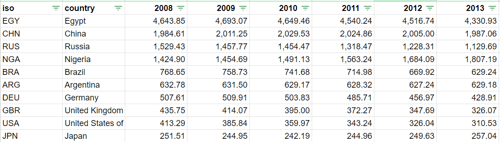
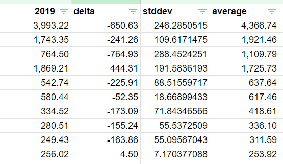
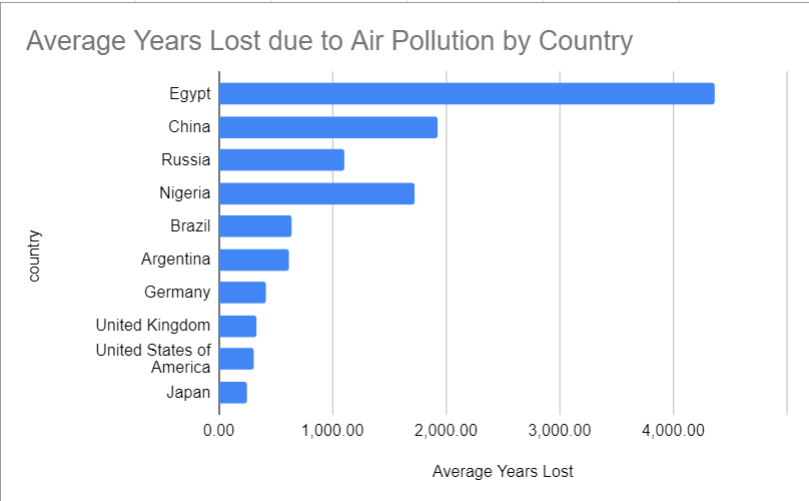
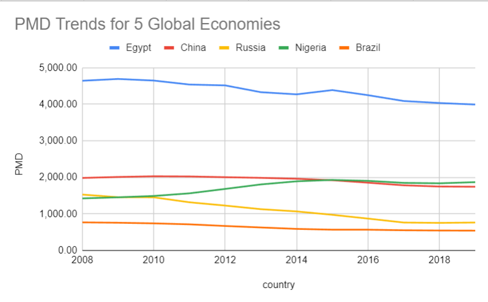
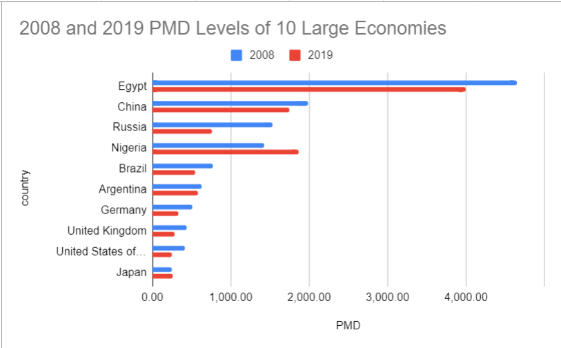

# Instructions

You are a data analyst at a Washington-based environmental consulting agency.

Recently, you’ve been tasked with analyzing the air-quality performance of 10 major economies across the world. You’ve been given a csv file named `PMD_full.csv` located in the `data` folder of this project. You will export this CSV file to Google Sheets to create calculations, visualizations, and pivot tables.

Utilize documentation, recordings, your peers, readings, and classroom notes to complete this project.

There is one difficulty level to this project. 

## Set-Up

To begin this project, you will first create a folder in your Google Drive account which will contain the `PMD_full.csv` file as well as a write-up labeled `Analysis` describing your observation of this analysis.

Check out [this tutorial](https://support.google.com/drive/answer/2375091?hl=en&co=GENIE.Platform%3DDesktop) on how to create a folder in Google Drive. 

You will be directly working on `PMD_full.csv` in Google Sheets by working through the steps below. 
 
## Part 1: Summary Statistics

First, we will be transforming our dataset by renaming, removing, & sorting columns. The steps below will walk through the discrete actions you need to take to transform your dataset.

1. Delete the `Code` column in your sheet.
2. Rename each column labeled `PMD.raw.20XX` to its respective year. So for example, column `PMD.raw.2008` will be renamed to `2008`, column `PMD.raw.2009` will be renamed to `2009`, and so forth. 
3. Round all continuous values to their second decimal place. Bear in mind, that by formatting our values to be `Numbers`, Google Sheets will round all values to the second decimal place. Check out the tutorial on how to reformat data types [here](https://support.google.com/docs/answer/56470?hl=en&co=GENIE.Platform%3DDesktop). 
4. Finally, apply a filter to all columns of your dataset and sort your `2008` from the largest value to the smallest. After you've completed this sort, `Egypt` should be in row 2, and `Japan` should be in row 11.

By the end of this step, your Google sheet should look like the screenshot below. Note that this screenshot is cut off at `2013`, however, we expect your data to retain all initial columns (up to 2019). 

## Part 2: Summary Statistics

After completing part 1, you will then calculate a series of summary statistics to observe trends and patterns of your dataset.

1. Calculate the difference between column `2019` and column `2008` for each row. List these values in a new column to the immediate right of column `2019`, and name this column `delta`.
2. Next, calculate the standard deviation of values from column `2008` to column `2019` for each row. List these values in a new column to the immediate right of column `delta`, and name this column `stddev`.
3. Next, calculate the average of values from column `2008` to column `2019` for each row. List these values in a new column to the immediate right of column `stddev`, and name this column `average`.

By the end of this step, your Google sheet should look like the screenshot below. Note that this screenshot only reveals columns `2019` and our calculated fields, however, we expect your data to retain all initial columns. 

## Part 3: Visualizations

Lastly, you will create 3 visualizations to explore the trends and patterns of your dataset. For each visualization, be sure to appropriately label your axes & titles.

1. Create a horizontal bar chart of the average years lost by each country in this dataset. You will be using the `average` and `country` columns to create this. Note: You can select multiple columns by holding `CTRL` for Windows or `CMD` for Mac.
2. Create a line chart of all the PMD columns **for only Egypt, Russia, China, Nigeria, & Brazil** to view their directionality. You will be using the `country` column, as well as all `PMD` columns from `2008` to `2019` to create this. Note: You can select multiple adjacent columns by clicking and dragging.
3. Lastly, create a horizontal bar chart that reveals the PMD of all countries for `2008` and `2019`. You will be using the  `country`, `2008`, and `2019` columns to create this.

By the end of this step, your visualizations will look like the following (respectively for each step):

  

## Part 4: Observations

Using the visualizations that you've created, answer the following questions in a Google Docs file (that you've created within the same folder of your Google Sheets file) named `Analysis`. 

> 1. What is the overall trend of PMD years across all these 10 countries?
> 2. Are there any individuals or sets of countries that go against this trend? 
> 3. Which country has experienced the largest change (both regarding decrease or increase) in `PMD` years across all 10 samples?
> 4. Which next steps would you take to figure out why certain countries had increases or decreases in the amount of years lost due to air pollution?

## Submission

The due date for this project is `11/16`.

To submit this project, you will [share](https://support.google.com/drive/answer/7166529?hl=en&co=GENIE.Platform%3DDesktop) this folder that you've created and submit the shared link to Canvas.

**Note**: Please be sure to share this folder before submitting your link. We will not be able to observe your work otherwise.